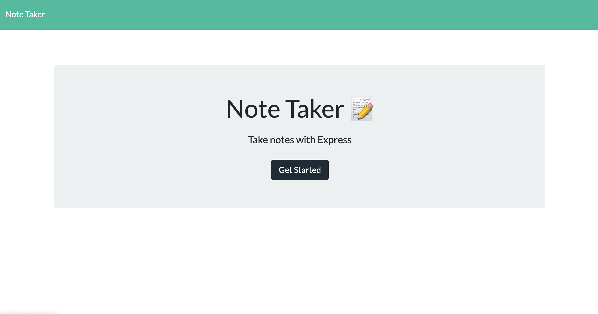
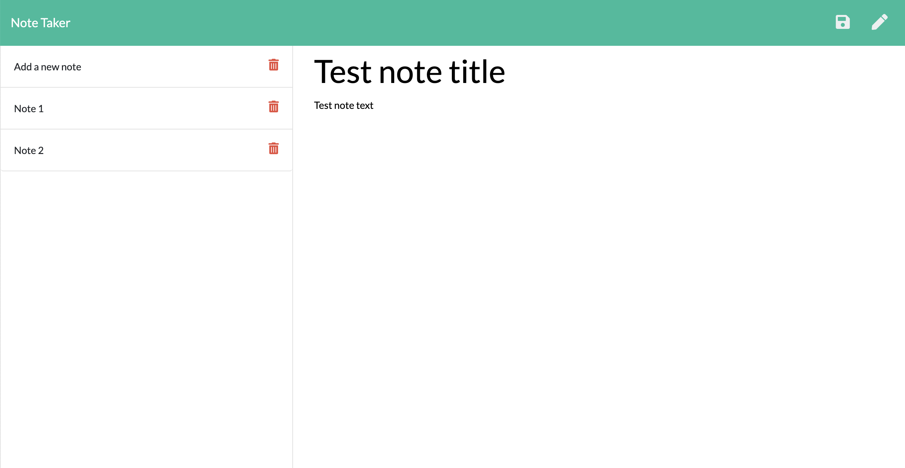

# Note-Taker

## Description  
  
 

## Deployed Link to App

## Take of Contents
- [Description](#description)
- [Link to App](#deployed-Link-to-App)
- [Usage](#usage)

## Usage
- Click on "Get Started" button to view your past notes or add a new note
- To add a new note, click on the edit button that looks like a pencil on the top right cornor of the webpage. Simply type in a title for the note and the corresponding text, click on the save button on the top right cornor to save. Your note should appear on the left of the page once saved
- To access one of your older notes, simply click on the note title
- To delete one of the notes, click on the red delete button to the right of the note title

